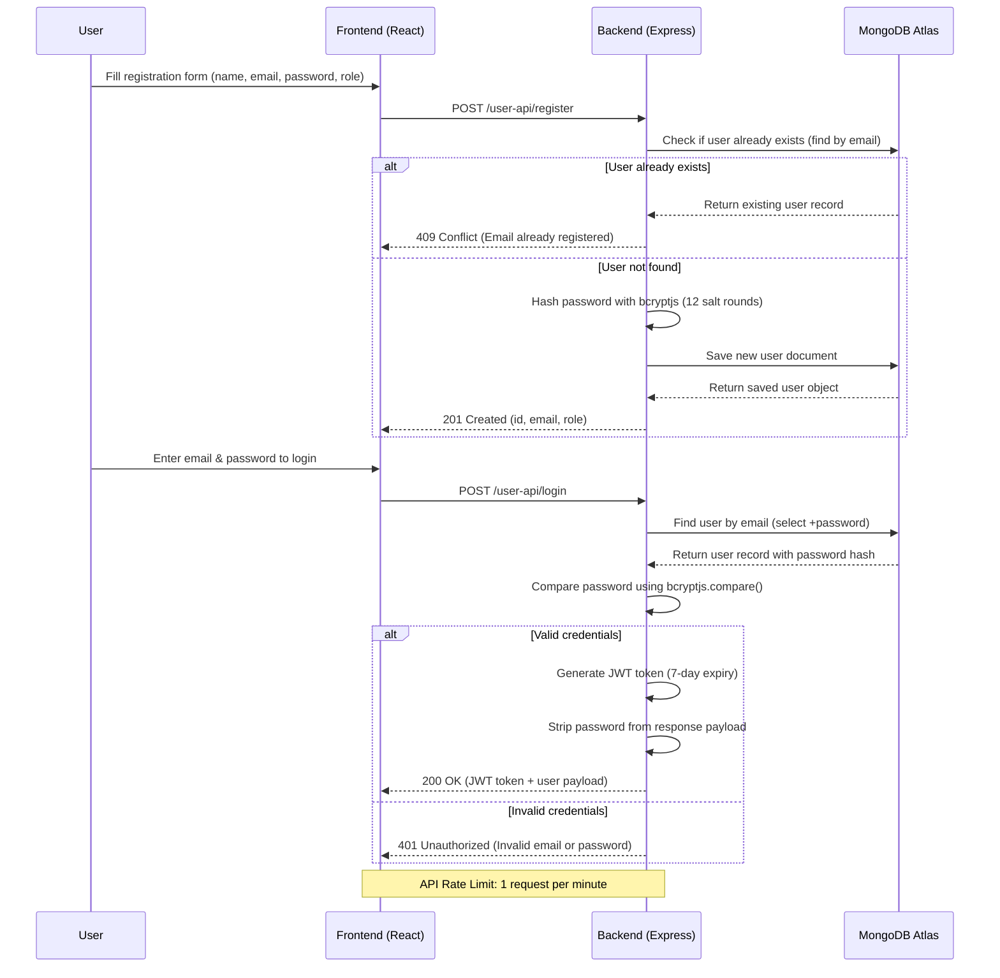
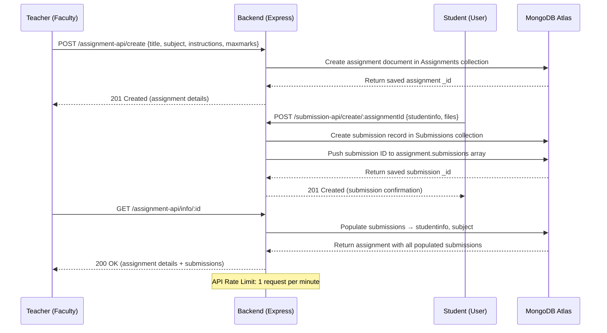
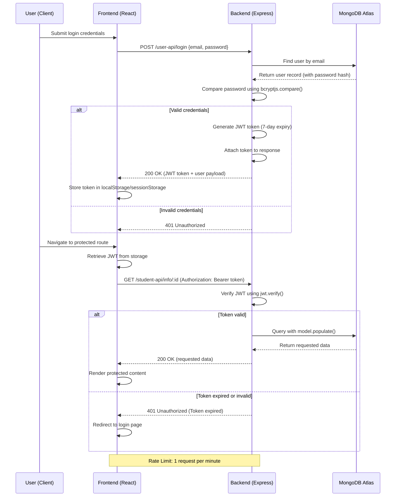

# 🎓 CampusFlow

**CampusFlow** is a full-stack campus management platform built with **React + Vite** (frontend) and **Express + MongoDB** (backend). It provides an integrated system for managing students, faculty, courses, departments, assignments, attendance, placements, events, and more.

---

## 🧭 Rendered system diagrams

The project architecture and its most important request paths are available as self-contained, accessible HTML diagrams generated with the `diagram-design` skill:

- [CampusFlow request architecture](docs/diagrams/campusflow-architecture.html) — client, API, controllers, models, and MongoDB boundaries.
- [Browser request flow](docs/diagrams/campusflow-request-flow.html) — routing, JWT authentication, validation, controller execution, and JSON responses.
- [JWT authentication sequence](docs/diagrams/campusflow-authentication-sequence.html) — login, user lookup, password verification, token issuance, and failure handling.

The detailed reference flowcharts below remain useful for endpoint-level behavior; these rendered diagrams provide the higher-level orientation first.

---

## 📋 Table of Contents

1. [Architecture Overview](#architecture-overview)
2. [Rendered System Diagrams](#rendered-system-diagrams)
3. [System Flowcharts](#system-flowcharts)
   - 1. [Overall Request Flow](#1-overall-request-flow)
   - 2. [User Registration & Authentication Flow](#2-user-registration--authentication-flow)
   - 3. [Assignment & Submission Flow](#3-assignment--submission-flow)
   - 4. [Attendance Flow](#4-attendance-flow)
   - 5. [Placement Drive Flow](#5-placement-drive-flow)
   - 6. [Subject & Course Management Flow](#6-subject--course-management-flow)
   - 7. [Request/Leave Management Flow](#7-requestleave-management-flow)
   - 8. [JWT Authentication & Authorization Flow](#8-jwt-authentication--authorization-flow)
   - 9. [Mongoose Populate & Cross-Collection Query Flow](#9-mongoose-populate--cross-collection-query-flow)
   - 10. [Soft Delete & Error Handling Flow](#10-soft-delete--error-handling-flow)
4. [Folder Structure](#folder-structure)
5. [Technology Stack](#technology-stack)
6. [Backend — Modules & APIs](#backend--modules--apis)
7. [Frontend — Structure & Working](#frontend--structure--working)
8. [Setup & Installation](#setup--installation)
9. [API Endpoint Reference](#api-endpoint-reference)

---

## 🏗️ Architecture Overview

### Component Layer Diagram

```
┌─────────────────────────────────────────────────────────────────────────┐
│                              CLIENT LAYER                                │
├─────────────────────────────────────────────────────────────────────────┤
│                           CLIENT BROWSER                                  │
│ ┌─────────────────────────────────────────────────────────────────────┐ │
│ │                                                                     │ │
│ │  ┌─────────────────────────────────────────────────────┐           │ │
│ │  │  ┌──────────────┐   ┌──────────────┐   ┌──────────┐  │           │ │
│ │  │  │   Vite Dev   │   │   React      │   │  Assets  │  │           │ │
│ │  │  │  Server      │◄──►│  Components  │   │  Images  │  │           │ │
│ │  │  └──────────────┘   └──────────────┘   └──────────┘  │           │ │
│ │  └─────────────────────────────────────────────────────┘           │ │
│ └─────────────────────────────────────────────────────────────────────┘ │
│                              (HTTP/HTTPS)                              │
├─────────────────────────────────────────────────────────────────────────┤
│                            SERVER LAYER                                 │
├─────────────────────────────────────────────────────────────────────────┤
│ ┌─────────────────────────────────────────────────────────────────────┐ │
│ │  ┌──────────────┐   ┌──────────────┐   ┌─────────────────────┐     │ │
│ │  │   Express    │──►│    Route     │──►│   Middleware &      │     │ │
│ │  │   Server     │   │   Handlers   │   │   Controllers       │     │ │
│ │  └──────────────┘   └──────────────┘   └─────────────────────┘     │ │
│ │         │                   │                                        │ │
│ │         ▼                   ▼                                        │ │
│ │  ┌──────────────┐   ┌──────────────┐                                 │ │
│ │  │   Routes     │   │   Models     │                                 │ │
│ │  │  (API Layer) │   │  (Mongoose)  │                                 │ │
│ │  └──────────────┘   └──────────────┘                                 │ │
│ └─────────────────────────────────────────────────────────────────────┘ │
│                              (Mongoose ODM)                            │
├─────────────────────────────────────────────────────────────────────────┤
│                           DATABASE LAYER                                │
├─────────────────────────────────────────────────────────────────────────┤
│ ┌─────────────────────────────────────────────────────────────────────┐ │
│ │                           MongoDB Atlas                            │ │
│ │ ┌───────────────────────────────────────────────────────────────┐   │ │
│ │ │                                                               │   │ │
│ │ │  ┌────────────┐  ┌────────────┐  ┌────────────┐  ┌─────────┐  │   │ │
│ │ │  │   Users    │  │ Courses    │  │ Subjects   │  │ Events  │  │   │ │
│ │ │  └────────────┘  └────────────┘  └────────────┘  └─────────┘  │   │ │
│ │ │  ┌────────────┐  ┌────────────┐  ┌────────────┐  ┌─────────┐  │   │ │
│ │ │  │Departments │  │Assignments │  │ Submissions│  │ Drivec  │  │   │ │
│ │ │  └────────────┘  └────────────┘  └────────────┘  └─────────┘  │   │ │
│ │ │                                                               │   │ │
│ │ └───────────────────────────────────────────────────────────────┘   │ │
│ └─────────────────────────────────────────────────────────────────────┘ │
└─────────────────────────────────────────────────────────────────────────┘
```

### Architecture Flow

The diagram below shows how requests flow through the CampusFlow system:

```mermaid
graph LR
    Browser[<img src='https://img.icons8.com/ios/50/000000/browser.png'/> Client Browser] -->|HTTP Request| Vite[Vite Dev Server]
    Vite -->|REST API Call| Express[Express Server]
    Express -->|Route Handler| Routes[API Routes]
    Routes -->|Mongoose Query| Models[Mongoose Models]
    Models -->|MongoDB Query| DB[(MongoDB Atlas)]
    DB -->|Data Response| Models
    Models -->|JSON Response| Routes
    Routes -->|JSON Response| Express
    Express -->|JSON Response| Vite
    Vite -->|Rendered UI| Browser

    style Vite fill:#646cff,stroke:#333,stroke-width:2px,color:#fff
    style Express fill:#41ab5d,stroke:#333,stroke-width:2px,color:#fff
    style Models fill:#ff9900,stroke:#333,stroke-width:2px,color:#fff
    style Browser fill:#e74c3c,stroke:#333,stroke-width:2px,color:#fff
```



### Multi-Layer Architecture Summary

| **Layer** | **Technology** | **Responsibilities** |
|-----------|----------------|-----------------------|
| **Presentation** | React + Vite | Renders UI components, handles client-side state |
| **API Gateway** | Express.js | Handles HTTP requests, CORS, static file serving, **Rate limiting (1 req/min)** |
| **Business Logic** | Controllers & Routes | Processes business rules, validation, data transformation |
| **Data Access** | Mongoose ODM | Object modeling, schema validation, query execution |
| **Database** | MongoDB Atlas | Data persistence, indexing, aggregation |

---

## 🔄 System Flowcharts

### 1. Overall Request Flow

```mermaid
flowchart LR
    UserBrowser[User Browser] -->|HTTP GET Request| ViteDev[Vite Dev Server]
    ViteDev -->|REST API Call| ExpressServer[Express Backend Server]
    ExpressServer -->|Route Match| RouteHandler[Route Handler]
    RouteHandler -->|Mongoose Query| MongooseModel[Model Method]
    MongooseModel -->|MongoDB Query| MongoDBAtlas[(MongoDB Atlas)]
    MongoDBAtlas -->|Data Response| MongooseModel
    MongooseModel -->|Serialized JSON| RouteHandler
    RouteHandler -->|JSON Response| ExpressServer
    ExpressServer -->|JSON Response| ViteDev
    ViteDev -->|Rendered HTML/CSS/JS| UserBrowser

    style UserBrowser fill:#e74c3c,stroke:#333,stroke-width:2px,color:#fff
    style ViteDev fill:#646cff,stroke:#333,stroke-width:2px,color:#fff
    style ExpressServer fill:#41ab5d,stroke:#333,stroke-width:2px,color:#fff
    style RouteHandler fill:#ffa500,stroke:#333,stroke-width:2px,color:#000
    style MongooseModel fill:#ff9900,stroke:#333,stroke-width:2px,color:#000
    style MongoDBAtlas fill:#47a241,stroke:#333,stroke-width:2px,color:#fff
```



### 2. User Registration & Authentication Flow



### 3. Assignment & Submission Flow



### 4. Attendance Flow

```mermaid
flowchart TB
    StartAttendance[Add Attendance Record] --> ValidateAttendance{Validate Fields:<br>studentinfo, subjectinfo, date, status}
    ValidateAttendance -->|All fields valid| CreateAttendance[Create attendance document]
    CreateAttendance --> SaveAttendance[Save to MongoDB Atlas - Attendance collection]
    SaveAttendance --> ReturnCreated[Return 201 Created (attendance _id)]

    ViewAttendanceBtn[View All Attendance Records] --> GetAttendanceEndpoint[GET /attendance-api/all]
    GetAttendanceEndpoint --> PopulateAttendance[Populate studentinfo + subjectinfo references]
    PopulateAttendance --> ReturnAllAttendance[Return all attendance records as JSON]

    UpdateAttendanceBtn[Update Attendance Status] --> UpdateAttendanceEndpoint[PATCH /attendance-api/update/:id]
    UpdateAttendanceEndpoint --> SetAttendanceStatus[Set status: 'present' | 'absent' | 'late']
    SetAttendanceStatus --> SaveUpdatedAttendance[Save updated record to MongoDB]
    SaveUpdatedAttendance --> ReturnUpdatedAttendance[Return 200 OK (updated attendance)]

    ValidateAttendance -->|Invalid fields| ReturnError[Return 400 Bad Request]

    style StartAttendance fill:#41ab5d,stroke:#333,stroke-width:2px,color:#fff
    style ReturnCreated fill:#41ab5d,stroke:#333,stroke-width:2px,color:#fff
    style ReturnAllAttendance fill:#41ab5d,stroke:#333,stroke-width:2px,color:#fff
    style ReturnUpdatedAttendance fill:#41ab5d,stroke:#333,stroke-width:2px,color:#fff

    Note over StartAttendance,ReturnUpdatedAttendance: Rate Limit: 1 request per minute
```

### 5. Placement Drive Flow

```mermaid
flowchart LR
    CompanyRegistered[Company Registered by HR/Admin] --> CollegeValidated{College validated<br>by admin approval}
    CollegeValidated -->|Valid| CreateDrive[Create Drive Record]
    CreateDrive --> SetEligibility[Set eligibility criteria:<br>minCGPA, maxBacklogs, allowedDepts]
    CreateDrive --> DefineStages[Define hiring stages:<br>Application → Aptitude → Technical → HR]
    DefineStages --> AppWindowOpen[Application Window Opens]
    AppWindowOpen --> StudentsApply[Students Apply via Form]
    StudentsApply --> StageProgress{Stage Evaluation}
    StageProgress -->|Pass| NextStage[Advance to Next Stage]
    StageProgress -->|Fail| Rejected[Student Marked as Rejected]
    NextStage -->|Pass All Stages| Placed[Student Placed ✅]

    style CompanyRegistered fill:#646cff,stroke:#333,stroke-width:2px,color:#fff
    style CollegeValidated fill:#ffa500,stroke:#333,stroke-width:2px,color:#000
    style CreateDrive fill:#41ab5d,stroke:#333,stroke-width:2px,color:#fff
    style Placed fill:#2ca02c,stroke:#333,stroke-width:2px,color:#fff

    Note over CompanyRegistered,Placed: Rate Limit: 1 request per minute
```

### 6. Subject & Course Management Flow

```mermaid
flowchart TD
    CollegeCreated[College Created in Database] --> DepartmentCreated[Department Created under College]
    DepartmentCreated --> CourseCreated[Course Created under Dept + College]
    CourseCreated --> SubjectCreated[Subject Created under Course + Dept + College + Teacher]
    SubjectCreated --> AssignmentCreated[Assignment Created under Subject]
    SubjectCreated --> AttendanceRecorded[Attendance Recorded for Subject]
    SubjectCreated --> DriveLinked[Placement Drive Linked to Course/Dept]

    style CollegeCreated fill:#646cff,stroke:#333,stroke-width:2px,color:#fff
    style DepartmentCreated fill:#41ab5d,stroke:#333,stroke-width:2px,color:#fff
    style CourseCreated fill:#ffa500,stroke:#333,stroke-width:2px,color:#000
    style SubjectCreated fill:#ff9900,stroke:#333,stroke-width:2px,color:#000

    Note over CollegeCreated,DriveLinked: Rate Limit: 1 request per minute
```

### 7. Request/Leave Management Flow

```mermaid
stateDiagram-v2
    [*] --> Submitted: User submits request/leave
    Submitted --> UnderReview: Admin review assigned
    UnderReview --> Approved: Request validated and approved
    UnderReview --> Rejected: Request invalid or denied
    Approved --> Escalated: Requires higher-level approval
    Rejected --> ReSubmitted: User resubmits revised request
    ReSubmitted --> UnderReview: Back to admin review
    Escalated --> FinalApproved: Final approval granted
    Escalated --> FinalRejected: Final rejection

    style Submitted fill:#646cff,stroke:#333,stroke-width:2px,color:#fff
    style Approved fill:#2ca02c,stroke:#333,stroke-width:2px,color:#fff
    style Rejected fill:#d62728,stroke:#333,stroke-width:2px,color:#fff

    Note over Submitted,Escalated: Rate Limit: 1 request per minute
```

### 8. JWT Authentication & Authorization Flow



### 9. Mongoose Populate & Cross-Collection Query Flow

```mermaid
flowchart LR
    GetUserRequest[GET /student-api/info/:id] --> FindStudent[Student Model.findById(id)]
    FindStudent --> PopulateUser[populate('studentinfo')<br>→ joins User collection]
    PopulateUser --> PopulateSubject[populate('subjectinfo')<br>→ joins Subject collection]
    PopulateSubject --> PopulateAssignment[populate('assignments')<br>→ joins Assignment collection]
    PopulateAssignment --> PopulateSubmission[populate('submissions')<br>→ joins Submission collection]
    PopulateSubmission --> PopulateTeacher[populate('teacherinfo')<br>→ joins User collection]

    GetUserRequest -->|Same flow applies to| GetAssignment[GET /assignment-api/info/:id]
    GetAssignment --> FindAssignment[Assignment Model.findById(id)]
    FindAssignment --> PopulateSubject2[populate('subjectinfo')<br>→ joins Subject collection]
    PopulateSubject2 --> PopulateStudent[populate('studentinfo')<br>→ joins User collection]

    GetUserRequest -->|Same flow applies to| GetAttendance[GET /attendance-api/all]
    GetAttendance --> FindAttendance[Attendance Model.find()]
    FindAttendance --> PopulateSubject3[populate('subjectinfo')<br>→ joins Subject collection]

    style GetUserRequest fill:#646cff,stroke:#333,stroke-width:2px,color:#fff
    style FindStudent fill:#41ab5d,stroke:#333,stroke-width:2px,color:#fff
    style FindAssignment fill:#41ab5d,stroke:#333,stroke-width:2px,color:#fff
    style FindAttendance fill:#41ab5d,stroke:#333,stroke-width:2px,color:#fff

    Note over GetUserRequest,PopulateTeacher: Rate Limit: 1 request per minute
```

### 10. Soft Delete & Error Handling Flow

```mermaid
flowchart TD
    UserDeleteRequest[DELETE /user-api/delete/:id] --> CheckReferences{Check for related<br>documents in<br>cross-collections?}
    CheckReferences -->|No references found| PerformSoftDelete[Query Model.findByIdAndUpdate<br>({ isActive: false })]
    PerformSoftDelete --> UpdateDB[Set isActive = false in document<br>and save to MongoDB]
    UpdateDB --> ReturnSuccess[Return 200 OK:<br>Record soft-deleted successfully]
    CheckReferences -->|Has references| PreventDelete[Return 400 Bad Request:<br>Cannot delete - has dependencies]

    UserDeleteRequest -->|Mongoose ValidationError| ValidationError[Catch ValidationError<br>(schema: required fields, enum)]
    ValidationError --> Return400[Return 400 Bad Request<br>{message: Validation failed}]

    UserDeleteRequest -->|Invalid ObjectId format| CastError[Catch CastError<br>(invalid ID format)]
    CastError --> Return400Cast[Return 400 Bad Request<br>{message: Invalid ID format}]

    UserDeleteRequest -->|Duplicate key violation| DuplicateKeyError[Catch MongoError<br>(code: 11000)]
    DuplicateKeyError --> Return409[Return 409 Conflict<br>{message: Duplicate field value}]

    style UserDeleteRequest fill:#646cff,stroke:#333,stroke-width:2px,color:#fff
    style PerformSoftDelete fill:#41ab5d,stroke:#333,stroke-width:2px,color:#fff
    style UpdateDB fill:#41ab5d,stroke:#333,stroke-width:2px,color:#fff
    style ReturnSuccess fill:#2ca02c,stroke:#333,stroke-width:2px,color:#fff

    Note over UserDeleteRequest,Return409: Rate Limit: 1 request per minute
```

---

## 📁 Folder Structure

```
CampusFlow/
│
├── 📂 Backend/                          # Node.js + Express server
│   ├── 📄 server.js                     # Main entry point - Express app setup
│   ├── 📄 package.json                  # Backend dependencies
│   │
│   ├── 📂 Apis/                         # Route definitions (Controllers)
│   │   ├── 📄 userapi.js              # User registration, login, update, delete
│   │   ├── 📄 studentapi.js           # Student profile CRUD
│   │   ├── 📄 faculty.js              # Faculty profile CRUD
│   │   ├── 📄 college.js              # College info CRUD
│   │   ├── 📄 dept.js                 # Department CRUD
│   │   ├── 📄 courses.js              # Course management CRUD
│   │   ├── 📄 subject.js              # Subject management CRUD
│   │   ├── 📄 assignment.js           # Assignment creation & management
│   │   ├── 📄 submission.js           # Submission handling & grading
│   │   ├── 📄 attendance.js           # Attendance recording & retrieval
│   │   ├── 📄 announcements.js        # Announcement create, retrieve, pin
│   │   ├── 📄 events.js               # Event CRUD
│   │   ├── 📄 company.js              # Company registration + recruiting toggle
│   │   ├── 📄 drive.js                # Placement drive CRUD + status updates
│   │   └── 📄 request.js              # Request/leave CRUD + status workflow
│   │
│   ├── 📂 modules/                      # Mongoose schemas & models
│   │   ├── 📄 User.js                   # User schema (role, email, id, password, etc.)
│   │   ├── 📄 studentmodule.js          # Student schema (user ref, cgpa, skills, etc.)
│   │   ├── 📄 faculty.js                # Faculty schema (college ref, dept ref, etc.)
│   │   ├── 📄 college.js                # College schema (name, code, address, etc.)
│   │   ├── 📄 department.js             # Department schema (college ref, hodid, etc.)
│   │   ├── 📄 courses.js                # Course schema (college + dept refs, credits)
│   │   ├── 📄 subject.js                # Subject schema (college, dept, course, teacher refs)
│   │   ├── 📄 assignment.js             # Assignment schema (subject ref, submissions)
│   │   ├── 📄 submission.js             # Submission schema (student ref, marks, grade)
│   │   ├── 📄 attendance.js             # Attendance schema (subject, student, status)
│   │   ├── 📄 announcement.js           # Announcement schema (courses, dept, priority, pinned)
│   │   ├── 📄 events.js                 # Events schema (courses, dept, category, dates)
│   │   ├── 📄 company.js                # Company schema (college ref, recruiting status)
│   │   ├── 📄 drive.js                  # Placement drive schema (stages, eligibility, status)
│   │   └── 📄 request.js                # Request schema (leave, grievance, etc.)
│   │
│   ├── 📂 middleware/                   # Custom middleware
│   │   └── 📄 rateLimiter.js            # Rate limiting (1 req/min per IP)
│   │
│   └── 📂 req/                          # HTTP request files for testing
│       ├── 📄 user.http
│       ├── 📄 studentreq.http
│       ├── 📄 facultyreq.http
│       ├── 📄 collegereq.http
│       ├── 📄 deptreq.http
│       ├── 📄 coursereq.http
│       ├── 📄 subjectreq.http
│       ├── 📄 assignmentreq.http
│       ├── 📄 submissionreq.http
│       ├── 📄 attendancereq.http
│       ├── 📄 announcementreq.http
│       ├── 📄 eventreq.http
│       ├── 📄 companyreq.http
│       ├── 📄 drivereq.http
│       └── 📄 requestreq.http
│
├── 📂 Frontend/                         # React + Vite frontend application
│   ├── 📄 package.json                  # Frontend dependencies
│   ├── 📄 vite.config.js                # Vite configuration with React plugin
│   ├── 📄 index.html                    # HTML entry point with root div
│   ├── 📄 eslint.config.js              # ESLint configuration
│   │
│   ├── 📂 public/                       # Static assets
│   │   ├── 🖼️ favicon.svg               # Site favicon
│   │   └── 🖼️ icons.svg                 # SVG icon sprite sheet
│   │
│   └── 📂 src/                          # React source code
│       ├── 📄 main.jsx                  # React entry point (StrictMode + createRoot)
│       ├── 📄 App.jsx                   # Main App component with hero + navigation
│       ├── 📄 App.css                   # Component-level styles
│       ├── 📄 index.css                 # Global styles, CSS variables, theming
│       │
│       └── 📂 assets/                   # Static image assets
│           ├── 🖼️ hero.png               # Hero section background image
│           ├── 🖼️ react.svg              # React logo
│           └── 🖼️ vite.svg               # Vite logo
│
└── 📄 README.md                         # This file
```
---

## 🛠️ Technology Stack

### Frontend
| Technology | Version | Purpose |
|---|---|---|
| **React** | ^19.2.8 | UI library |
| **Vite** | ^8.2.2 | Build tool & dev server |
| **ESLint** | ^10.9.0 | Code linting |

### Backend
| Technology | Version | Purpose |
|---|---|---|
| **Express.js** | ^5.2.1 | Web framework |
| **MongoDB + Mongoose** | ^9.9.4 | Database & ORM |
| **bcryptjs** | ^3.0.3 | Password hashing |
| **jsonwebtoken** | ^9.0.3 | Authentication tokens |
| **multer** | ^2.3.0 | File upload handling |
| **Nodemon** | ^3.1.14 | Dev server auto-restart |

---

## ⚙️ Backend — Modules & APIs

### Server Configuration (`server.js`)

- **Port**: `4000`
- **Database**: `mongodb://localhost:27017/campusflow`
- **Middleware**: `express.json()` for JSON parsing
- **Error Handling**: Built-in middleware for `ValidationError`, `CastError`, duplicate keys, and 404s
- **Route Prefixes**: Each module is mounted under a namespace

```javascript
app.use("/user-api", userapp)
app.use("/student-api", studentapp)
app.use("/faculty-api", facultyapp)
app.use("/college-api", collegeapp)
app.use("/dept-api", deptapp)
app.use("/course-api", courseapp)
app.use("/subject-api", subjectapp)
app.use("/assignment-api", assignmentapp)
app.use("/submission-api", submissionapp)
app.use("/attendance-api", attendanceapp)
```

### Module Details

#### 👤 User Module (`modules/User.js`)
- **Fields**: `role` (enum: teacher, student, placement-office, hod), `username`, `email`, `id`, `password`, `phno`, `department`, `branch`, `avatar`, `isActive`
- **Authentication**: Password hashing with bcryptjs (12 rounds), JWT tokens with 1-day expiry
- **Soft Delete**: Sets `isActive: false` instead of deleting records
- **Forgot Password**: Reset password via email
- **Change Password**: Verify current password before changing

#### 🎓 Student Module (`modules/studentmodule.js`)
- **References**: `user` (ObjectId → User)
- **Fields**: `skills[]`, `cgpa`, `admissionYear`, `graduationYear`, `program`, `linkedinUrl`, `githubUrl`, `portfolioUrl`, `resume`, `isActive`

#### 🏫 College Module (`modules/college.js`)
- **Fields**: `name`, `code`, `address`, `contact` (phone/email/website), `desp`, `logo`
- **Operations**: Full CRUD with duplicate checking on `code`

#### 🏢 Department Module (`modules/department.js`)
- **References**: `collegeinfo` → College, `hodid` → User
- **Fields**: `name`, `code`, `desp`

#### 📚 Course Module (`modules/courses.js`)
- **References**: `collegeinfo` → College, `deptinfo` → Department
- **Fields**: `name`, `code`, `credits`, `duration`, `descp`

#### 📖 Subject Module (`modules/subject.js`)
- **References**: `collegeinfo`, `deptinfo`, `courseinfo`, `teacherinfo` (→ User)
- **Fields**: `name`, `code`, `descp`, `credits`

#### 📝 Assignment Module (`modules/assignment.js`)
- **References**: `subjectinfo` → Subject, `teacherinfo` → User, `submissions[]` → Submission
- **Fields**: `name`, `descp`, `instructions`, `maxmarks`, `duedate`

#### 📤 Submission Module (`modules/submission.js`)
- **References**: `studentinfo` → User, `assignment` → Assignment
- **Fields**: `marksobtained`, `grade`
- **Auto-link**: When a submission is created, its ID is pushed to the assignment's `submissions` array

#### 📅 Attendance Module (`modules/attendance.js`)
- **References**: `subjectinfo` → Subject, `studentid` → User
- **Status**: `present`, `absent`, `late`

#### 📢 Announcement Module (`modules/announcement.js`)
- **References**: `coursesinfo` → Courses, `deptinfo` → Department, `postedby` → User
- **Fields**: `name`, `content`, `priority`, `ispinned`

#### 🏢 Company Module (`modules/company.js`)
- **References**: `collegeinfo` → College
- **Fields**: `name`, `sector`, `industry`, `hrname`, `hrphno`, `hremail`, `desp`, `logo`, `isRecruiting`

#### 💼 Drive Module (`modules/drive.js`)
- **References**: `collegeinfo`, `courseinfo`, `deptinfo`, `companyinfo`
- **Fields**: `name`, `jobType`, `descp`, `role`, `location`, `salary`, `eligibility`, `stages[]`, `applicationStart`, `applicationEnd`, `status`

#### 🎉 Events Module (`modules/events.js`)
- **References**: `coursesinfo`, `deptinfo`
- **Fields**: `name`, `decp`, `category`, `startdate`, `enddate`, `members`, `logo`

#### 📋 Request Module (`modules/request.js`)
- **References**: `userinfo` → User
- **Categories**: `leave`, `document_request`, `fee_related`, `course_drop`, `subject_change`, `project_extension`, `grievance`, `other`
- **Fields**: `title`, `subject`, `attachments`, `action`, `priority`

---

## 🌐 Frontend — Structure & Working

### Entry Point (`src/main.jsx`)
- Wraps `<App />` in React's `<StrictMode>`
- Uses `createRoot` to render into `#root` div

### Main Component (`src/App.jsx`)
- **State**: `count` (useState hook) — interactive counter demo
- **Sections**:
  - `#center` — Hero section with logo overlays (base React + Vite logos), title, HMR instruction, counter button
  - `#next-steps` — Two-column layout with **Documentation** (Vite, React links) and **Connect with us** (GitHub, Discord, X.com, Bluesky links)
- **Assets**: `hero.png` (background), `react.svg`, `vite.svg` (logo overlays)

### Styling
- **`src/index.css`** — Global CSS custom properties (`:root`) with light/dark mode support via `@media (prefers-color-scheme: dark)`. Defines font stack, color palette, spacing, and responsive breakpoints.
- **`src/App.css`** — Component-specific styles for the counter button, hero layout, documentation/social sections, and decorative `.ticks` elements.

### Vite Configuration (`vite.config.js`)
```javascript
import react from '@vitejs/plugin-react'
import { defineConfig } from 'vite'
export default defineConfig({ plugins: [react()] })
```
---

## 🚀 Setup & Installation

### Prerequisites
- **Node.js** v18+
- **MongoDB** (local or cloud URI)
- **npm** or **yarn**

### 1. Clone & Navigate
```bash
cd CampusFlow
```

### 2. Backend Setup
```bash
cd Backend
npm install
# Set MONGODB_URI environment variable (optional, defaults to localhost)
# Default: mongodb://localhost:27017/campusflow
npm run dev    # Starts server on port 4000 with nodemon
```

### 3. Frontend Setup
```bash
cd Frontend
npm install
npm run dev    # Starts Vite dev server on port 5173
```

### 4. Verify
- Backend health check: `GET http://localhost:4000/`
- Frontend: `http://localhost:5173`

---

## 📡 API Endpoint Reference

### User API (`/user-api`)
| Method | Endpoint | Description |
|--------|----------|-------------|
| POST | `/register` | Register new user with hashed password |
| POST | `/login` | Login with email/password, returns JWT |
| PATCH | `/update/:id` | Update user details |
| PATCH | `/delete/:id` | Soft delete (set isActive: false) |
| POST | `/forgot` | Reset password by email |
| POST | `/change-password/:id` | Change password with current password verification |
| GET | `/all` | Get all active users (password excluded) |

### Student API (`/student-api`)
| Method | Endpoint | Description |
|--------|----------|-------------|
| POST | `/basic-info` | Create student profile (requires user ref) |
| GET | `/info/:id` | Get student profile with populated user |
| PATCH | `/update/:id` | Update student profile |

### Faculty API (`/faculty-api`)
| Method | Endpoint | Description |
|--------|----------|-------------|
| POST | `/basic-info` | Create faculty profile |
| GET | `/info/:id` | Get faculty with populated user, college, dept |
| PATCH | `/update/:id` | Update faculty profile |

### College API (`/college-api`)
| Method | Endpoint | Description |
|--------|----------|-------------|
| POST | `/info` | Create college |
| GET | `/all` | Get all colleges |
| GET | `/info/:id` | Get single college |
| PATCH | `/update/:id` | Update college |
| DELETE | `/delete/:id` | Delete college |

### Department API (`/dept-api`)
| Method | Endpoint | Description |
|--------|----------|-------------|
| POST | `/create` | Create department |
| GET | `/info/:id` | Get department with populated college + HOD |
| GET | `/all` | Get all departments |
| PATCH | `/update/:id` | Update department |
| DELETE | `/delete/:id` | Delete department |

### Course API (`/course-api`)
| Method | Endpoint | Description |
|--------|----------|-------------|
| POST | `/create` | Create course |
| GET | `/info/:id` | Get course with populated college + dept |
| GET | `/all` | Get all courses |
| PATCH | `/update/:id` | Update course |
| DELETE | `/delete/:id` | Delete course |

### Subject API (`/subject-api`)
| Method | Endpoint | Description |
|--------|----------|-------------|
| POST | `/create` | Create subject |
| GET | `/info/:id` | Get subject with populated college, dept, course, teacher |
| GET | `/all` | Get all subjects |
| PATCH | `/update/:id` | Update subject |
| DELETE | `/delete/:id` | Delete subject |

### Assignment API (`/assignment-api`)
| Method | Endpoint | Description |
|--------|----------|-------------|
| POST | `/create` | Create assignment |
| GET | `/info/:id` | Get assignment with populated submissions & student info |
| GET | `/all` | Get all assignments |
| PATCH | `/update/:id` | Update assignment |
| DELETE | `/delete/:id` | Delete assignment |

### Submission API (`/submission-api`)
| Method | Endpoint | Description |
|--------|----------|-------------|
| POST | `/create/:id` | Create submission for assignment, auto-links to assignment |
| GET | `/info/:id` | Get submission with populated student + assignment |
| GET | `/all` | Get all submissions |
| PATCH | `/update/:id` | Update submission (marks/grade) |
| DELETE | `/delete/:id` | Delete submission, removes from assignment |

### Attendance API (`/attendance-api`)
| Method | Endpoint | Description |
|--------|----------|-------------|
| POST | `/add` | Add attendance record |
| GET | `/info/:id` | Get attendance with populated student + subject |
| GET | `/all` | Get all attendance records |
| PATCH | `/update/:id` | Update attendance status |
| DELETE | `/delete/:id` | Delete attendance record |

### Announcement API (`/announcement-api`)
| Method | Endpoint | Description |
|--------|----------|-------------|
| POST | `/create` | Create announcement for a course + dept |
| GET | `/info/:id` | Get announcement with populated course, dept, postedby |
| GET | `/all` | Get all announcements |
| PATCH | `/update/:id` | Update announcement details |
| DELETE | `/delete/:id` | Delete announcement |
| PATCH | `/pin/:id` | Toggle announcement pin status |

### Event API (`/event-api`)
| Method | Endpoint | Description |
|--------|----------|-------------|
| POST | `/create` | Create event for a course + dept |
| GET | `/info/:id` | Get event with populated course, dept |
| GET | `/all` | Get all events |
| PATCH | `/update/:id` | Update event details |
| DELETE | `/delete/:id` | Delete event |

### Company API (`/company-api`)
| Method | Endpoint | Description |
|--------|----------|-------------|
| POST | `/create` | Register company under a college |
| GET | `/info/:id` | Get company with populated college |
| GET | `/all` | Get all companies |
| PATCH | `/update/:id` | Update company details |
| DELETE | `/delete/:id` | Delete company |
| PATCH | `/toggle-recruiting/:id` | Toggle recruitment status |

### Placement Drive API (`/drive-api`)
| Method | Endpoint | Description |
|--------|----------|-------------|
| POST | `/create` | Create placement drive for company/course/dept |
| GET | `/info/:id` | Get drive with all populated references |
| GET | `/all` | Get all drives |
| PATCH | `/update/:id` | Update drive details |
| DELETE | `/delete/:id` | Delete drive |
| PATCH | `/update-status/:id` | Update drive status |

### Request/Leave API (`/request-api`)
| Method | Endpoint | Description |
|--------|----------|-------------|
| POST | `/create` | Submit a new request or leave |
| GET | `/all` | Get all requests with populated user |
| GET | `/user/:userId` | Get all requests for a specific user |
| GET | `/info/:id` | Get request by ID with populated user |
| PATCH | `/update/:id` | Update request details |
| DELETE | `/delete/:id` | Delete request |
| PATCH | `/update-status/:id` | Update request status (workflow) |

---

---

## ⚙️ Rate Limiting

The backend implements a **custom rate limiting middleware** (`middleware/rateLimiter.js`) that enforces:

- **1 request per minute (60,000ms)** per client IP address
- **HTTP 429 (Too Many Requests)** response when the limit is exceeded
- Response includes:
  - `limit`: The rate limit configuration
  - `retryAfter`: Seconds until the next request can be made
  - `resetAt`: ISO timestamp of when the rate limit window resets

### How It Works

1. Each incoming request is intercepted by the `rateLimit` middleware
2. The client IP is extracted (supports proxies via `req.ip`)
3. Request timestamps are stored in an in-memory `Map` keyed by IP
4. Timestamps older than 60 seconds are filtered out before checking
5. If the client has already made 1 request in the current window, a 429 response is returned
6. Otherwise, the current timestamp is recorded and the request proceeds
7. The store is periodically cleaned up to prevent memory leaks (>10,000 entries)

### Usage

The rate limiter is applied to **all API routes** at the Express app level in `server.js`:

```js
import { rateLimit } from './middleware/rateLimiter.js';

// Applied to all routes
app.use(rateLimit);
```


## 🔗 Key Relationships Between Models

```
User (role-based)
  ├── Student → studentmodule.js (user: ObjectId ref)
  ├── Faculty → faculty.js (user, collegeinfo, deptinfo)
  ├── Department → department.js (collegeinfo, hodid → User)
  ├── Course → courses.js (collegeinfo, deptinfo)
  ├── Subject → subject.js (collegeinfo, deptinfo, courseinfo, teacherinfo)
  ├── Assignment → assignment.js (subjectinfo, teacherinfo)
  └── Request → request.js (userinfo → User)

College
  ├── Department
  ├── Course
  └── Company

Department
  ├── Course
  ├── Subject
  └── Event

Subject
  ├── Assignment → Submission (studentinfo → User)
  └── Attendance (studentid → User)

Company
  └── Drive → (collegeinfo, courseinfo, deptinfo, companyinfo)
```

---

## 📝 Notes

- All passwords are hashed with **bcryptjs** before storing in MongoDB.
- **JWT tokens** expire in **1 day** and are used for authenticated routes (commented out in current version).
- The backend uses **soft delete** patterns (`isActive: false`) instead of hard deletion.
- **Rate limiting** is enforced at **1 request per minute per IP** using a custom in-memory middleware (`middleware/rateLimiter.js`).
- **Error middleware** handles Mongoose validation errors, Cast errors, and duplicate key errors gracefully.
- **Announcements API**, **Events API**, **Company API**, **Drives API**, and **Requests API** are fully implemented with full CRUD operations.
- `req/*.http` files are provided for manual API testing with VS Code REST Client.


---

## 📄 License

ISC

