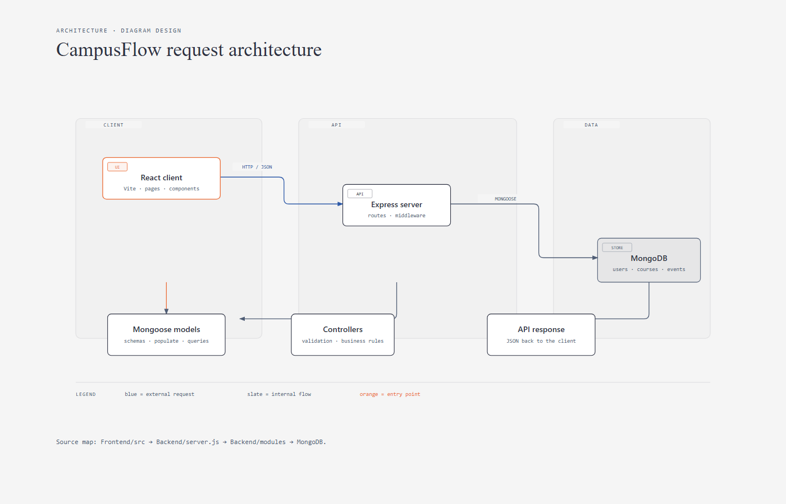
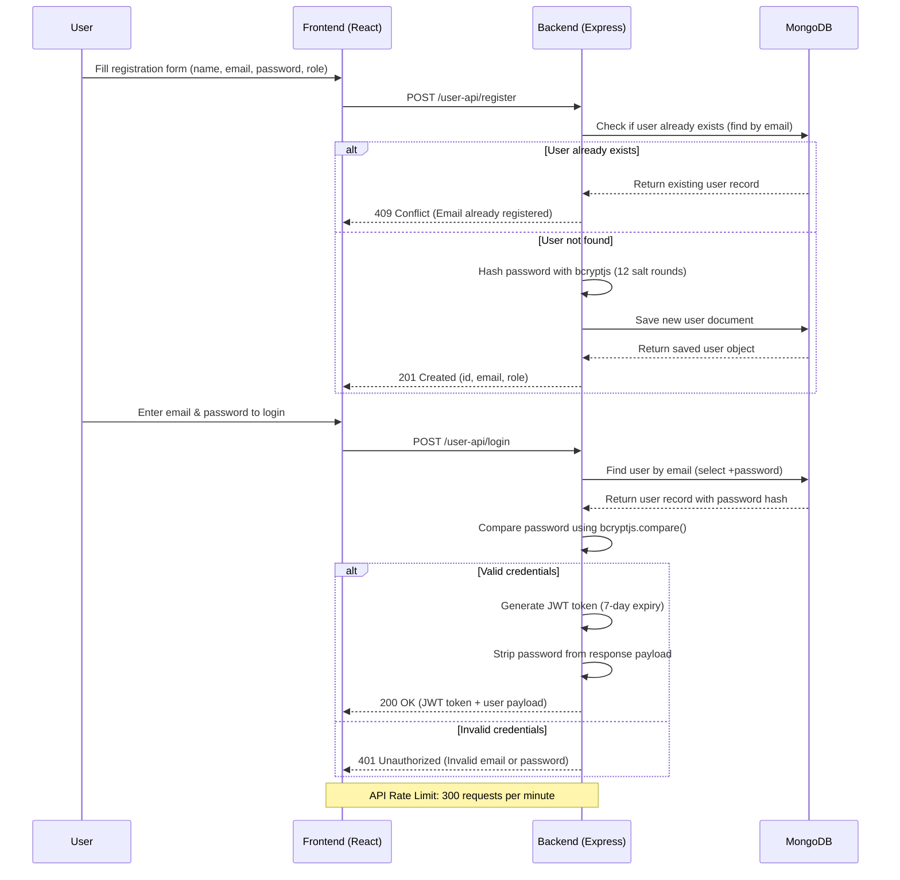

# 🎓 CampusFlow

**CampusFlow** is a full-stack campus management platform built with **React + Vite** (frontend) and **Express + MongoDB** (backend). It provides an integrated system for managing students, faculty, courses, departments, assignments, attendance, placements, events, and more.

## 🚀 Quick start

### Prerequisites

- Node.js 20.19+ or 22.12+ (required by the current Vite toolchain)
- npm
- MongoDB running locally, or a MongoDB connection string

### 1. Start the backend

```bash
cd Backend
npm install
npm run dev
```

The API starts at `http://127.0.0.1:4000`. It remains available while MongoDB reconnects; data routes return `503` until the database is ready.

### 2. Seed optional demo data

```bash
cd Backend
npm run seed:all
npm run verify:data
```

### 3. Start the frontend

Create `Frontend/.env.local` only when you need to override the default API URL:

```env
VITE_API_URL=http://127.0.0.1:4000
```

Then run:

```bash
cd Frontend
npm install
npm run dev
```

Open `http://localhost:5173`.

### Health checks

- Liveness: `GET http://127.0.0.1:4000/`
- Readiness: `GET http://127.0.0.1:4000/health` (`503` while MongoDB is unavailable)

Component-specific setup and design notes are available in the [backend README](Backend/README.md) and [frontend README](Frontend/README.md).


---

## 🧭 Rendered system diagrams

The diagrams below are self-contained, accessible HTML files generated from the project structure:

- [Backend request architecture](docs/diagrams/campusflow-architecture.html) — Express, middleware, controllers, Mongoose, and MongoDB boundaries.
- [Browser request flow](docs/diagrams/campusflow-request-flow.html) — routing, JWT authentication, validation, controller execution, and JSON responses.
- [JWT authentication sequence](docs/diagrams/campusflow-authentication-sequence.html) — login, user lookup, password verification, token issuance, and failure handling.

[](docs/diagrams/campusflow-architecture.html)

The detailed reference flowcharts below provide endpoint-level behavior.

---

## 📋 Table of Contents

1. [Quick start](#quick-start)
2. [Rendered System Diagrams](#rendered-system-diagrams)
3. [Architecture Overview](#architecture-overview)
4. [System Flowcharts](#system-flowcharts)
   - 1. [Overall Request Flow](#1-overall-request-flow)
   - 2. [User Registration & Authentication Flow](#2-user-registration--authentication-flow)
   - 3. [Assignment & Submission Flow](#3-assignment--submission-flow)
   - 4. [Attendance Flow](#4-attendance-flow)
   - 5. [Placement Drive Flow](#5-placement-drive-flow)
   - 6. [Subject & Course Management Flow](#6-subject--course-management-flow)
   - 7. [Request/Leave Management Flow](#7-requestleave-management-flow)
   - 8. [JWT Authentication & Authorization Flow](#8-jwt-authentication--authorization-flow)
   - 9. [Mongoose Populate & Cross-Collection Query Flow](#9-mongoose-populate--cross-collection-query-flow)
   - 10. [Soft Delete & Error Handling Flow](#10-soft-delete--error-handling-flow)
5. [Folder Structure](#folder-structure)
6. [Technology Stack](#technology-stack)
7. [Backend — Modules & APIs](#backend--modules--apis)
8. [Frontend — Structure & Working](#frontend--structure--working)
9. [Setup & Installation](#setup--installation)
10. [API Endpoint Reference](#api-endpoint-reference)
11. [Rate Limiting](#rate-limiting)
12. [Key Relationships Between Models](#key-relationships-between-models)

---

## 🏗️ Architecture Overview

### Component Layer Diagram

```
┌─────────────────────────────────────────────────────────────────────────┐
│                              CLIENT LAYER                                │
├─────────────────────────────────────────────────────────────────────────┤
│                           CLIENT BROWSER                                  │
│ ┌─────────────────────────────────────────────────────────────────────┐ │
│ │                                                                     │ │
│ │  ┌─────────────────────────────────────────────────────┐           │ │
│ │  │  ┌──────────────┐   ┌──────────────┐   ┌──────────┐  │           │ │
│ │  │  │   Vite Dev   │   │   React      │   │  Assets  │  │           │ │
│ │  │  │  Server      │◄──►│  Components  │   │  Images  │  │           │ │
│ │  │  └──────────────┘   └──────────────┘   └──────────┘  │           │ │
│ │  └─────────────────────────────────────────────────────┘           │ │
│ └─────────────────────────────────────────────────────────────────────┘ │
│                              (HTTP/HTTPS)                              │
├─────────────────────────────────────────────────────────────────────────┤
│                            SERVER LAYER                                 │
├─────────────────────────────────────────────────────────────────────────┤
│ ┌─────────────────────────────────────────────────────────────────────┐ │
│ │  ┌──────────────┐   ┌──────────────┐   ┌─────────────────────┐     │ │
│ │  │   Express    │──►│    Route     │──►│   Middleware &      │     │ │
│ │  │   Server     │   │   Handlers   │   │   Controllers       │     │ │
│ │  └──────────────┘   └──────────────┘   └─────────────────────┘     │ │
│ │         │                   │                                        │ │
│ │         ▼                   ▼                                        │ │
│ │  ┌──────────────┐   ┌──────────────┐                                 │ │
│ │  │   Routes     │   │   Models     │                                 │ │
│ │  │  (API Layer) │   │  (Mongoose)  │                                 │ │
│ │  └──────────────┘   └──────────────┘                                 │ │
│ └─────────────────────────────────────────────────────────────────────┘ │
│                              (Mongoose ODM)                            │
├─────────────────────────────────────────────────────────────────────────┤
│                           DATABASE LAYER                                │
├─────────────────────────────────────────────────────────────────────────┤
│ ┌─────────────────────────────────────────────────────────────────────┐ │
│ │                              MongoDB                              │ │
│ │ ┌───────────────────────────────────────────────────────────────┐   │ │
│ │ │                                                               │   │ │
│ │ │  ┌────────────┐  ┌────────────┐  ┌────────────┐  ┌─────────┐  │   │ │
│ │ │  │   Users    │  │ Courses    │  │ Subjects   │  │ Events  │  │   │ │
│ │ │  └────────────┘  └────────────┘  └────────────┘  └─────────┘  │   │ │
│ │ │  ┌────────────┐  ┌────────────┐  ┌────────────┐  ┌─────────┐  │   │ │
│ │ │  │Departments │  │Assignments │  │ Submissions│  │ Drivec  │  │   │ │
│ │ │  └────────────┘  └────────────┘  └────────────┘  └─────────┘  │   │ │
│ │ │                                                               │   │ │
│ │ └───────────────────────────────────────────────────────────────┘   │ │
│ └─────────────────────────────────────────────────────────────────────┘ │
└─────────────────────────────────────────────────────────────────────────┘
```

### Architecture Flow

The diagram below shows how requests flow through the CampusFlow system:

```mermaid
graph LR
    Browser[<img src='https://img.icons8.com/ios/50/000000/browser.png'/> Client Browser] -->|HTTP Request| Vite[Vite Dev Server]
    Vite -->|REST API Call| Express[Express Server]
    Express -->|Route Handler| Routes[API Routes]
    Routes -->|Mongoose Query| Models[Mongoose Models]
    Models -->|MongoDB Query| DB[(MongoDB)]
    DB -->|Data Response| Models
    Models -->|JSON Response| Routes
    Routes -->|JSON Response| Express
    Express -->|JSON Response| Vite
    Vite -->|Rendered UI| Browser

    style Vite fill:#646cff,stroke:#333,stroke-width:2px,color:#fff
    style Express fill:#41ab5d,stroke:#333,stroke-width:2px,color:#fff
    style Models fill:#ff9900,stroke:#333,stroke-width:2px,color:#fff
    style Browser fill:#e74c3c,stroke:#333,stroke-width:2px,color:#fff
```



### Multi-Layer Architecture Summary

| **Layer** | **Technology** | **Responsibilities** |
|-----------|----------------|-----------------------|
| **Presentation** | React + Vite | Renders UI components, handles client-side state |
| **API Gateway** | Express.js | Handles HTTP requests, origin checks, cookies, readiness, and rate limiting |
| **Business Logic** | Controllers & Routes | Processes validation, authorization, workflow, and data transformation |
| **Data Access** | Mongoose ODM | Object modeling, schema validation, population, and query execution |
| **Database** | MongoDB | Data persistence, indexing, and aggregation (local or Atlas) |

---

## 🔄 System Flowcharts

### 1. Overall Request Flow


### 2. User Registration & Authentication Flow



### 3. Assignment & Submission Flow


### 4. Attendance Flow

```mermaid
flowchart TB
    StartAttendance[Add Attendance Record] --> ValidateAttendance{Validate Fields:<br>studentinfo, subjectinfo, date, status}
    ValidateAttendance -->|All fields valid| CreateAttendance[Create attendance document]
    CreateAttendance --> SaveAttendance[Save to MongoDB - Attendance collection]
    SaveAttendance --> ReturnCreated[Return 201 Created (attendance _id)]

    ViewAttendanceBtn[View All Attendance Records] --> GetAttendanceEndpoint[GET /attendance-api/all]
    GetAttendanceEndpoint --> PopulateAttendance[Populate studentinfo + subjectinfo references]
    PopulateAttendance --> ReturnAllAttendance[Return all attendance records as JSON]

    UpdateAttendanceBtn[Update Attendance Status] --> UpdateAttendanceEndpoint[PATCH /attendance-api/update/:id]
    UpdateAttendanceEndpoint --> SetAttendanceStatus[Set status: 'present' | 'absent' | 'late']
    SetAttendanceStatus --> SaveUpdatedAttendance[Save updated record to MongoDB]
    SaveUpdatedAttendance --> ReturnUpdatedAttendance[Return 200 OK (updated attendance)]

    ValidateAttendance -->|Invalid fields| ReturnError[Return 400 Bad Request]

    style StartAttendance fill:#41ab5d,stroke:#333,stroke-width:2px,color:#fff
    style ReturnCreated fill:#41ab5d,stroke:#333,stroke-width:2px,color:#fff
    style ReturnAllAttendance fill:#41ab5d,stroke:#333,stroke-width:2px,color:#fff
    style ReturnUpdatedAttendance fill:#41ab5d,stroke:#333,stroke-width:2px,color:#fff

    Note over StartAttendance,ReturnUpdatedAttendance: Rate Limit: 300 requests per minute
```

### 5. Placement Drive Flow

```mermaid
flowchart LR
    CompanyRegistered[Company Registered by HR/Admin] --> CollegeValidated{College validated<br>by admin approval}
    CollegeValidated -->|Valid| CreateDrive[Create Drive Record]
    CreateDrive --> SetEligibility[Set eligibility criteria:<br>minCGPA, maxBacklogs, allowedDepts]
    CreateDrive --> DefineStages[Define hiring stages:<br>Application → Aptitude → Technical → HR]
    DefineStages --> AppWindowOpen[Application Window Opens]
    AppWindowOpen --> StudentsApply[Students Apply via Form]
    StudentsApply --> StageProgress{Stage Evaluation}
    StageProgress -->|Pass| NextStage[Advance to Next Stage]
    StageProgress -->|Fail| Rejected[Student Marked as Rejected]
    NextStage -->|Pass All Stages| Placed[Student Placed ✅]

    style CompanyRegistered fill:#646cff,stroke:#333,stroke-width:2px,color:#fff
    style CollegeValidated fill:#ffa500,stroke:#333,stroke-width:2px,color:#000
    style CreateDrive fill:#41ab5d,stroke:#333,stroke-width:2px,color:#fff
    style Placed fill:#2ca02c,stroke:#333,stroke-width:2px,color:#fff

    Note over CompanyRegistered,Placed: Rate Limit: 300 requests per minute
```

### 6. Subject & Course Management Flow

```mermaid
flowchart TD
    CollegeCreated[College Created in Database] --> DepartmentCreated[Department Created under College]
    DepartmentCreated --> CourseCreated[Course Created under Dept + College]
    CourseCreated --> SubjectCreated[Subject Created under Course + Dept + College + Teacher]
    SubjectCreated --> AssignmentCreated[Assignment Created under Subject]
    SubjectCreated --> AttendanceRecorded[Attendance Recorded for Subject]
    SubjectCreated --> DriveLinked[Placement Drive Linked to Course/Dept]

    style CollegeCreated fill:#646cff,stroke:#333,stroke-width:2px,color:#fff
    style DepartmentCreated fill:#41ab5d,stroke:#333,stroke-width:2px,color:#fff
    style CourseCreated fill:#ffa500,stroke:#333,stroke-width:2px,color:#000
    style SubjectCreated fill:#ff9900,stroke:#333,stroke-width:2px,color:#000

    Note over CollegeCreated,DriveLinked: Rate Limit: 300 requests per minute
```

### 7. Request/Leave Management Flow

```mermaid
stateDiagram-v2
    [*] --> Submitted: User submits request/leave
    Submitted --> UnderReview: Admin review assigned
    UnderReview --> Approved: Request validated and approved
    UnderReview --> Rejected: Request invalid or denied
    Approved --> Escalated: Requires higher-level approval
    Rejected --> ReSubmitted: User resubmits revised request
    ReSubmitted --> UnderReview: Back to admin review
    Escalated --> FinalApproved: Final approval granted
    Escalated --> FinalRejected: Final rejection

    style Submitted fill:#646cff,stroke:#333,stroke-width:2px,color:#fff
    style Approved fill:#2ca02c,stroke:#333,stroke-width:2px,color:#fff
    style Rejected fill:#d62728,stroke:#333,stroke-width:2px,color:#fff

    Note over Submitted,Escalated: Rate Limit: 300 requests per minute
```

### 8. JWT Authentication & Authorization Flow


### 9. Mongoose Populate & Cross-Collection Query Flow

```mermaid
flowchart LR
    GetUserRequest[GET /student-api/info/:id] --> FindStudent[Student Model.findById(id)]
    FindStudent --> PopulateUser[populate('studentinfo')<br>→ joins User collection]
    PopulateUser --> PopulateSubject[populate('subjectinfo')<br>→ joins Subject collection]
    PopulateSubject --> PopulateAssignment[populate('assignments')<br>→ joins Assignment collection]
    PopulateAssignment --> PopulateSubmission[populate('submissions')<br>→ joins Submission collection]
    PopulateSubmission --> PopulateTeacher[populate('teacherinfo')<br>→ joins User collection]

    GetUserRequest -->|Same flow applies to| GetAssignment[GET /assignment-api/info/:id]
    GetAssignment --> FindAssignment[Assignment Model.findById(id)]
    FindAssignment --> PopulateSubject2[populate('subjectinfo')<br>→ joins Subject collection]
    PopulateSubject2 --> PopulateStudent[populate('studentinfo')<br>→ joins User collection]

    GetUserRequest -->|Same flow applies to| GetAttendance[GET /attendance-api/all]
    GetAttendance --> FindAttendance[Attendance Model.find()]
    FindAttendance --> PopulateSubject3[populate('subjectinfo')<br>→ joins Subject collection]

    style GetUserRequest fill:#646cff,stroke:#333,stroke-width:2px,color:#fff
    style FindStudent fill:#41ab5d,stroke:#333,stroke-width:2px,color:#fff
    style FindAssignment fill:#41ab5d,stroke:#333,stroke-width:2px,color:#fff
    style FindAttendance fill:#41ab5d,stroke:#333,stroke-width:2px,color:#fff

    Note over GetUserRequest,PopulateTeacher: Rate Limit: 300 requests per minute
```

### 10. Soft Delete & Error Handling Flow

```mermaid
flowchart TD
    UserDeleteRequest[DELETE /user-api/delete/:id] --> CheckReferences{Check for related<br>documents in<br>cross-collections?}
    CheckReferences -->|No references found| PerformSoftDelete[Query Model.findByIdAndUpdate<br>({ isActive: false })]
    PerformSoftDelete --> UpdateDB[Set isActive = false in document<br>and save to MongoDB]
    UpdateDB --> ReturnSuccess[Return 200 OK:<br>Record soft-deleted successfully]
    CheckReferences -->|Has references| PreventDelete[Return 400 Bad Request:<br>Cannot delete - has dependencies]

    UserDeleteRequest -->|Mongoose ValidationError| ValidationError[Catch ValidationError<br>(schema: required fields, enum)]
    ValidationError --> Return400[Return 400 Bad Request<br>{message: Validation failed}]

    UserDeleteRequest -->|Invalid ObjectId format| CastError[Catch CastError<br>(invalid ID format)]
    CastError --> Return400Cast[Return 400 Bad Request<br>{message: Invalid ID format}]

    UserDeleteRequest -->|Duplicate key violation| DuplicateKeyError[Catch MongoError<br>(code: 11000)]
    DuplicateKeyError --> Return409[Return 409 Conflict<br>{message: Duplicate field value}]

    style UserDeleteRequest fill:#646cff,stroke:#333,stroke-width:2px,color:#fff
    style PerformSoftDelete fill:#41ab5d,stroke:#333,stroke-width:2px,color:#fff
    style UpdateDB fill:#41ab5d,stroke:#333,stroke-width:2px,color:#fff
    style ReturnSuccess fill:#2ca02c,stroke:#333,stroke-width:2px,color:#fff

    Note over UserDeleteRequest,Return409: Rate Limit: 300 requests per minute
```

---

## 📁 Folder Structure

```
CampusFlow/
│
├── 📂 Backend/                          # Node.js + Express server
│   ├── 📄 server.js                     # Main entry point - Express app setup
│   ├── 📄 package.json                  # Backend dependencies
│   │
│   ├── 📂 Apis/                         # Route definitions (Controllers)
│   │   ├── 📄 userapi.js              # User registration, login, update, delete
│   │   ├── 📄 studentapi.js           # Student profile CRUD
│   │   ├── 📄 faculty.js              # Faculty profile CRUD
│   │   ├── 📄 college.js              # College info CRUD
│   │   ├── 📄 dept.js                 # Department CRUD
│   │   ├── 📄 courses.js              # Course management CRUD
│   │   ├── 📄 subject.js              # Subject management CRUD
│   │   ├── 📄 room.js                 # Room directory
│   │   ├── 📄 timetable.js            # Published timetable queries
│   │   ├── 📄 assignment.js           # Assignment creation & management
│   │   ├── 📄 submission.js           # Submission handling & grading
│   │   ├── 📄 attendance.js           # Attendance recording & retrieval
│   │   ├── 📄 announcements.js        # Announcement create, retrieve, pin
│   │   ├── 📄 events.js               # Event CRUD
│   │   ├── 📄 company.js              # Company registration + recruiting toggle
│   │   ├── 📄 drive.js                # Placement drive CRUD + status updates
│   │   └── 📄 request.js              # Request/leave CRUD + status workflow
│   │
│   ├── 📂 modules/                      # Mongoose schemas & models
│   │   ├── 📄 User.js                   # User schema (role, email, id, password, etc.)
│   │   ├── 📄 studentmodule.js          # Student schema (user ref, cgpa, skills, etc.)
│   │   ├── 📄 faculty.js                # Faculty schema (college ref, dept ref, etc.)
│   │   ├── 📄 college.js                # College schema (name, code, address, etc.)
│   │   ├── 📄 department.js             # Department schema (college ref, hodid, etc.)
│   │   ├── 📄 courses.js                # Course schema (college + dept refs, credits)
│   │   ├── 📄 subject.js                # Subject schema (college, dept, course, teacher refs)
│   │   ├── 📄 room.js                   # Room schema
│   │   ├── 📄 timetable.js              # Timetable schema and period references
│   │   ├── 📄 assignment.js             # Assignment schema (subject ref, submissions)
│   │   ├── 📄 submission.js             # Submission schema (student ref, marks, grade)
│   │   ├── 📄 attendance.js             # Attendance schema (subject, student, status)
│   │   ├── 📄 announcement.js           # Announcement schema (courses, dept, priority, pinned)
│   │   ├── 📄 events.js                 # Events schema (courses, dept, category, dates)
│   │   ├── 📄 company.js                # Company schema (college ref, recruiting status)
│   │   ├── 📄 drive.js                  # Placement drive schema (stages, eligibility, status)
│   │   └── 📄 request.js                # Request schema (leave, grievance, etc.)
│   │
│   ├── 📂 middleware/                   # Authentication, rate limiting, and uploads
│   │   ├── 📄 rateLimiter.js            # Rate limiting (300 requests/minute per IP)
│   │   ├── 📄 verifyToken.js            # JWT cookie and role verification
│   │   └── 📄 upload.js                 # Multer limits and attachment helpers
│   │
│   ├── 📂 req/                          # HTTP request files for testing
│   │   ├── 📄 user.http
│   │   ├── 📄 studentreq.http
│   │   ├── 📄 facultyreq.http
│   │   ├── 📄 collegereq.http
│   │   ├── 📄 deptreq.http
│   │   ├── 📄 coursereq.http
│   │   ├── 📄 subjectreq.http
│   │   ├── 📄 assignmentreq.http
│   │   ├── 📄 submissionreq.http
│   │   ├── 📄 attendancereq.http
│   │   ├── 📄 announcementreq.http
│   │   ├── 📄 eventreq.http
│   │   ├── 📄 companyreq.http
│   │   ├── 📄 drivereq.http
│   │   └── 📄 requestreq.http
│
│   ├── 📄 README.md                    # Backend-specific guide
│
├── 📂 Frontend/                         # React + Vite frontend application
│   ├── 📄 package.json                  # Frontend dependencies
│   ├── 📄 vite.config.js                # Vite configuration with React plugin
│   ├── 📄 index.html                    # HTML entry point with root div
│   ├── 📄 eslint.config.js              # ESLint configuration
│   │
│   ├── 📂 public/                       # Static assets
│   │   ├── 🖼️ favicon.svg               # Site favicon
│   │   └── 🖼️ icons.svg                 # SVG icon sprite sheet
│   │
│   └── 📂 src/                          # React source code
│       ├── 📄 main.jsx                  # React entry point (StrictMode + createRoot)
│       ├── 📄 App.jsx                   # Providers, hash routes, and preloader
│       ├── 📄 common.js                 # Design tokens and landing content
│       ├── 📄 index.css                 # Global styles
│       │
│       ├── 📂 components/               # Landing sections and reusable animated UI
│       ├── 📂 lib/                      # API, auth, hash router, and UI store
│       ├── 📂 pages/                    # Landing, auth, and role-aware dashboard
│       │
│       └── 📂 assets/                   # Static image assets
│           ├── 🖼️ hero.png               # Hero section background image
│           ├── 🖼️ react.svg              # React logo
│           └── 🖼️ vite.svg               # Vite logo
│
└── 📄 README.md                         # This file
```
---

## 🛠️ Technology Stack

### Frontend
| Technology | Version | Purpose |
|---|---|---|
| **React** | ^19.2.8 | UI library |
| **Vite** | ^8.2.2 | Build tool & dev server |
| **Tailwind CSS** | ^4.3.3 | Utility-first styling through the Vite plugin |
| **Motion / GSAP / Three.js** | Current package versions | Interface and introduction animation |
| **ESLint** | ^10.9.0 | Code linting |

### Backend
| Technology | Version | Purpose |
|---|---|---|
| **Express.js** | ^5.2.1 | Web framework |
| **MongoDB + Mongoose** | ^9.9.4 | Database & ORM |
| **bcryptjs** | ^3.0.3 | Password hashing |
| **jsonwebtoken** | ^9.0.3 | Authentication tokens |
| **multer** | ^2.3.0 | File upload handling |
| **Node.js watch mode** | Built in | Restarts `server.js` during `npm run dev` |

---

## ⚙️ Backend — Modules & APIs

### Server Configuration (`server.js`)

- **Port**: `PORT` or `4000` by default
- **Database**: `MONGO_DIRECT_URI`, then `MONGO_URI`, then `mongodb://localhost:27017/campusflow`
- **Middleware**: cookie parsing, JSON parsing, origin checks, in-memory rate limiting, and database readiness checks
- **Authentication**: one-day JWT in an HTTP-only cookie, with route-level role authorization
- **Error Handling**: Built-in middleware for `ValidationError`, `CastError`, duplicate keys, and 404s
- **Route Prefixes**: Each module is mounted under a namespace

```javascript
app.use("/user-api", userapp)
app.use("/student-api", studentapp)
app.use("/faculty-api", facultyapp)
app.use("/college-api", collegeapp)
app.use("/dept-api", deptapp)
app.use("/course-api", courseapp)
app.use("/subject-api", subjectapp)
app.use("/room-api", roomapp)
app.use("/timetable-api", timetableapp)
app.use("/assignment-api", assignmentapp)
app.use("/submission-api", submissionapp)
app.use("/attendance-api", attendanceapp)
```

### Module Details

#### 👤 User Module (`modules/User.js`)
- **Fields**: `role` (enum: teacher, student, placement-office, hod), `username`, `email`, `id`, `password`, `phno`, `department`, `branch`, `avatar`, `isActive`
- **Authentication**: Password hashing with bcryptjs (12 rounds), JWT tokens with 1-day expiry
- **Soft Delete**: Sets `isActive: false` instead of deleting records
- **Password Recovery**: Direct reset via `/forgot` is disabled; use authenticated password change or an administrator-managed reset
- **Change Password**: Verify current password before changing

#### 🎓 Student Module (`modules/studentmodule.js`)
- **References**: `user` (ObjectId → User)
- **Fields**: `skills[]`, `cgpa`, `admissionYear`, `graduationYear`, `program`, `linkedinUrl`, `githubUrl`, `portfolioUrl`, `resume`, `isActive`

#### 🏫 College Module (`modules/college.js`)
- **Fields**: `name`, `code`, `address`, `contact` (phone/email/website), `desp`, `logo`
- **Operations**: Full CRUD with duplicate checking on `code`

#### 🏢 Department Module (`modules/department.js`)
- **References**: `collegeinfo` → College, `hodid` → User
- **Fields**: `name`, `code`, `desp`

#### 📚 Course Module (`modules/courses.js`)
- **References**: `collegeinfo` → College, `deptinfo` → Department
- **Fields**: `name`, `code`, `credits`, `duration`, `descp`

#### 📖 Subject Module (`modules/subject.js`)
- **References**: `collegeinfo`, `deptinfo`, `courseinfo`, `teacherinfo` (→ User)
- **Fields**: `name`, `code`, `descp`, `credits`

#### 📝 Assignment Module (`modules/assignment.js`)
- **References**: `subjectinfo` → Subject, `teacherinfo` → User, `submissions[]` → Submission
- **Fields**: `name`, `descp`, `instructions`, `maxmarks`, `duedate`

#### 📤 Submission Module (`modules/submission.js`)
- **References**: `studentinfo` → User, `assignment` → Assignment
- **Fields**: `marksobtained`, `grade`
- **Auto-link**: When a submission is created, its ID is pushed to the assignment's `submissions` array

#### 📅 Attendance Module (`modules/attendance.js`)
- **References**: `subjectinfo` → Subject, `studentid` → User
- **Status**: `present`, `absent`, `late`

#### 📢 Announcement Module (`modules/announcement.js`)
- **References**: `coursesinfo` → Courses, `deptinfo` → Department, `postedby` → User
- **Fields**: `name`, `content`, `priority`, `ispinned`

#### 🏢 Company Module (`modules/company.js`)
- **References**: `collegeinfo` → College
- **Fields**: `name`, `sector`, `industry`, `hrname`, `hrphno`, `hremail`, `desp`, `logo`, `isRecruiting`

#### 💼 Drive Module (`modules/drive.js`)
- **References**: `collegeinfo`, `courseinfo`, `deptinfo`, `companyinfo`
- **Fields**: `name`, `jobType`, `descp`, `role`, `location`, `salary`, `eligibility`, `stages[]`, `applicationStart`, `applicationEnd`, `status`

#### 🎉 Events Module (`modules/events.js`)
- **References**: `coursesinfo`, `deptinfo`
- **Fields**: `name`, `decp`, `category`, `startdate`, `enddate`, `members`, `logo`

#### 📋 Request Module (`modules/request.js`)
- **References**: `userinfo` → User
- **Categories**: `leave`, `document_request`, `fee_related`, `course_drop`, `subject_change`, `project_extension`, `grievance`, `other`
- **Fields**: `title`, `subject`, `attachments`, `action`, `priority`

---

## 🌐 Frontend — Structure & Working

- **`src/App.jsx`** composes the intro preloader, authentication provider, hash router, public pages, and role-protected dashboard.
- **Routes** use hash paths: `#/`, `#/login`, `#/signup`, `#/dashboard`, and `#/dashboard/<feature>`.
- **`src/lib/auth.jsx`** restores the session through `/user-api/check-auth` and exposes login, registration, logout, and refresh operations.
- **`src/lib/api.js`** centralizes the API origin, credentialed JSON requests, `FormData` uploads, downloads, and structured errors.
- **`src/pages/dashboard.jsx`** provides the role-aware application shell; **`dashboardFeatures.jsx`** contains the feature workspaces.
- **`src/components/` and `src/pages/`** contain the landing experience, authentication forms, dashboard, and reusable animated UI sections.
- **`src/index.css`, `src/common.js`, and component CSS files** provide global styles, design tokens, and responsive layouts.
- **`vite.config.js`** enables React, Tailwind CSS 4, and the `@` alias to `src`.

See the [frontend README](Frontend/README.md) for routes, structure, and commands.

---

## 🚀 Setup & Installation

For current commands and environment variables, use the [backend README](Backend/README.md) and [frontend README](Frontend/README.md). The quick start at the top of this guide covers the complete startup sequence.

---

## 📡 API Endpoint Reference

### User API (`/user-api`)
| Method | Endpoint | Description |
|--------|----------|-------------|
| POST | `/register` | Register a student account with a hashed password |
| POST | `/login` | Authenticate with email/password and set the JWT cookie |
| GET | `/logout` | Clear the authentication cookie |
| GET | `/check-auth` | Return the active user for a valid JWT cookie |
| PATCH | `/update/:id` | Update permitted user fields |
| PATCH | `/delete/:id` | Soft delete (set `isActive: false`) |
| POST | `/forgot` | Return `410`; direct password reset is disabled |
| POST | `/change-password/:id` | Change the current user's password after verification |
| GET | `/all` | Get role-scoped active users (password excluded) |

### Student API (`/student-api`)
| Method | Endpoint | Description |
|--------|----------|-------------|
| GET | `/all` | Get role-scoped student profiles with users populated |
| POST | `/basic-info` | Create student profile (requires user ref) |
| GET | `/info/:id` | Get student profile with populated user |
| PATCH | `/update/:id` | Update student profile |

### Faculty API (`/faculty-api`)
| Method | Endpoint | Description |
|--------|----------|-------------|
| GET | `/all` | Get role-scoped faculty profiles with users populated |
| POST | `/basic-info` | Create faculty profile |
| GET | `/info/:id` | Get faculty with populated user, college, dept |
| PATCH | `/update/:id` | Update faculty profile |

### College API (`/college-api`)
| Method | Endpoint | Description |
|--------|----------|-------------|
| POST | `/info` | Create college |
| GET | `/all` | Get all colleges |
| GET | `/info/:id` | Get single college |
| PATCH | `/update/:id` | Update college |
| DELETE | `/delete/:id` | Delete college |

### Department API (`/dept-api`)
| Method | Endpoint | Description |
|--------|----------|-------------|
| POST | `/create` | Create department |
| GET | `/info/:id` | Get department with populated college + HOD |
| GET | `/all` | Get all departments |
| PATCH | `/update/:id` | Update department |
| DELETE | `/delete/:id` | Delete department |

### Course API (`/course-api`)
| Method | Endpoint | Description |
|--------|----------|-------------|
| POST | `/create` | Create course |
| GET | `/info/:id` | Get course with populated college + dept |
| GET | `/all` | Get all courses |
| PATCH | `/update/:id` | Update course |
| DELETE | `/delete/:id` | Delete course |

### Subject API (`/subject-api`)
| Method | Endpoint | Description |
|--------|----------|-------------|
| POST | `/create` | Create subject |
| GET | `/curriculum/btech-3` | Get the seeded B.Tech semester curriculum |
| GET | `/info/:id` | Get subject with populated college, dept, course, teacher |
| GET | `/all` | Get all subjects |
| PATCH | `/update/:id` | Update subject |
| DELETE | `/delete/:id` | Delete subject |

### Room API (`/room-api`)
| Method | Endpoint | Description |
|--------|----------|-------------|
| GET | `/all` | Get active rooms sorted by code |
| GET | `/info/:id` | Get room details |

### Timetable API (`/timetable-api`)
| Method | Endpoint | Description |
|--------|----------|-------------|
| GET | `/current` | Get the published timetable for branch, year, and semester |
| GET | `/day/:day` | Get one day from the published timetable |

### Assignment API (`/assignment-api`)
| Method | Endpoint | Description |
|--------|----------|-------------|
| POST | `/create` | Create assignment with an uploaded file |
| GET | `/info/:id` | Get assignment with populated submissions & student info |
| GET | `/all` | Get all assignments visible to the current role |
| GET | `/download/:id/:index` | Download an assignment attachment |
| PATCH | `/update/:id` | Update assignment |
| DELETE | `/delete/:id` | Delete assignment |

### Submission API (`/submission-api`)
| Method | Endpoint | Description |
|--------|----------|-------------|
| POST | `/create/:id` | Create or replace a student's assignment submission |
| GET | `/info/:id` | Get an accessible submission with references populated |
| GET | `/all` | Get submissions visible to the current role |
| GET | `/download/:id/:index` | Download an accessible submission attachment |
| PATCH | `/review/:id` | Review/grade a submission (authorized faculty, HOD, or admin) |
| DELETE | `/delete/:id` | Delete an accessible submission and remove its assignment link |

### Attendance API (`/attendance-api`)
| Method | Endpoint | Description |
|--------|----------|-------------|
| POST | `/mark` | Create attendance records for a subject |
| GET | `/info/:id` | Get attendance with populated student + subject |
| GET | `/all` | Get all attendance records |
| PATCH | `/update/:id` | Update attendance status |
| DELETE | `/delete/:id` | Delete attendance record |

### Announcement API (`/announcement-api`)
| Method | Endpoint | Description |
|--------|----------|-------------|
| POST | `/create` | Create announcement for a course + dept |
| GET | `/info/:id` | Get announcement with populated course, dept, postedby |
| GET | `/all` | Get all announcements |
| PATCH | `/update/:id` | Update announcement details |
| DELETE | `/delete/:id` | Delete announcement |
| PATCH | `/pin/:id` | Toggle announcement pin status |

### Event API (`/event-api`)
| Method | Endpoint | Description |
|--------|----------|-------------|
| POST | `/create` | Create event for a course + dept |
| GET | `/info/:id` | Get event with populated course, dept |
| GET | `/all` | Get all events |
| PATCH | `/update/:id` | Update event details |
| DELETE | `/delete/:id` | Delete event |

### Company API (`/company-api`)
| Method | Endpoint | Description |
|--------|----------|-------------|
| POST | `/create` | Register company under a college |
| GET | `/info/:id` | Get company with populated college |
| GET | `/all` | Get all companies |
| PATCH | `/update/:id` | Update company details |
| DELETE | `/delete/:id` | Delete company |
| PATCH | `/toggle-recruiting/:id` | Toggle recruitment status |

### Placement Drive API (`/drive-api`)
| Method | Endpoint | Description |
|--------|----------|-------------|
| POST | `/create` | Create placement drive for company/course/dept |
| GET | `/info/:id` | Get drive with all populated references |
| GET | `/all` | Get all drives |
| PATCH | `/update/:id` | Update drive details |
| DELETE | `/delete/:id` | Delete drive |
| PATCH | `/update-status/:id` | Update drive status |

### Request/Leave API (`/request-api`)
| Method | Endpoint | Description |
|--------|----------|-------------|
| POST | `/create` | Submit a request or leave with an optional attachment |
| GET | `/all` | Get all requests for reviewers or the current user's requests |
| GET | `/user/:userId` | Get requests for a permitted user |
| GET | `/info/:id` | Get an accessible request with user/reviewer populated |
| GET | `/download/:id/:index` | Download an accessible attachment |
| PATCH | `/update/:id` | Update request details within role/status permissions |
| PATCH | `/review/:id` | Review, approve, reject, escalate, or comment (HOD/admin) |
| DELETE | `/delete/:id` | Delete an accessible request |

---

---

## ⚙️ Rate Limiting

The backend implements a **custom in-memory rate limiting middleware** (`middleware/rateLimiter.js`) that enforces:

- **300 requests per 60,000 ms window** per client IP address
- **HTTP 429 (Too Many Requests)** when the limit is exceeded
- A response containing `limit`, `retryAfter`, and `resetAt`

### How It Works

1. Each incoming request is intercepted by `rateLimit`.
2. The client IP is read from `req.ip` with a connection fallback.
3. Request timestamps are stored in an in-memory `Map` keyed by IP.
4. Timestamps older than 60 seconds are removed from the current window.
5. At 300 retained requests, the middleware returns `429` instead of calling the route.
6. Otherwise, the current timestamp is recorded and the request proceeds.
7. When the map exceeds 10,000 entries, expired IP histories are cleaned up.

Because the store is process-local, use a shared store such as Redis when running multiple API instances.

### Usage

The rate limiter is applied to **all API routes** at the Express app level in `server.js`:

```js
import { rateLimit } from './middleware/rateLimiter.js';

// Applied to all routes
app.use(rateLimit);
```


## 🔗 Key Relationships Between Models

```
User (role-based)
  ├── Student → studentmodule.js (user: ObjectId ref)
  ├── Faculty → faculty.js (user, collegeinfo, deptinfo)
  ├── Department → department.js (collegeinfo, hodid → User)
  ├── Course → courses.js (collegeinfo, deptinfo)
  ├── Subject → subject.js (collegeinfo, deptinfo, courseinfo, teacherinfo)
  ├── Assignment → assignment.js (subjectinfo, teacherinfo)
  └── Request → request.js (userinfo → User)

College
  ├── Department
  ├── Course
  └── Company

Department
  ├── Course
  ├── Subject
  └── Event

Subject
  ├── Assignment → Submission (studentinfo → User)
  └── Attendance (studentid → User)

Company
  └── Drive → (collegeinfo, courseinfo, deptinfo, companyinfo)
```

---

## 📝 Notes

- All passwords are hashed with **bcryptjs** before storing in MongoDB.
- **JWT tokens** expire in **1 day** and are sent in an HTTP-only cookie for authenticated routes.
- Some user/profile resources use soft-delete patterns (`isActive: false`), while workflow records such as submissions and requests may be hard-deleted.
- **Rate limiting** is enforced at **300 requests per minute per IP** using a custom in-memory middleware.
- **Error middleware** handles Mongoose validation errors, cast errors, and duplicate keys gracefully.
- The backend also includes rooms, timetables, curriculum data, authenticated downloads, upload validation, and role-scoped list endpoints.
- `Backend/req/*.http` files are provided for manual API testing with VS Code REST Client.


---

## 📄 License

ISC

